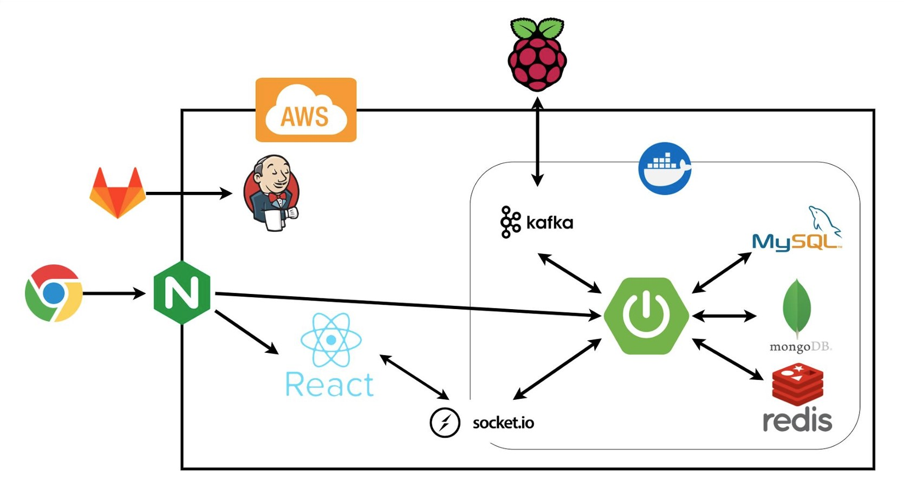
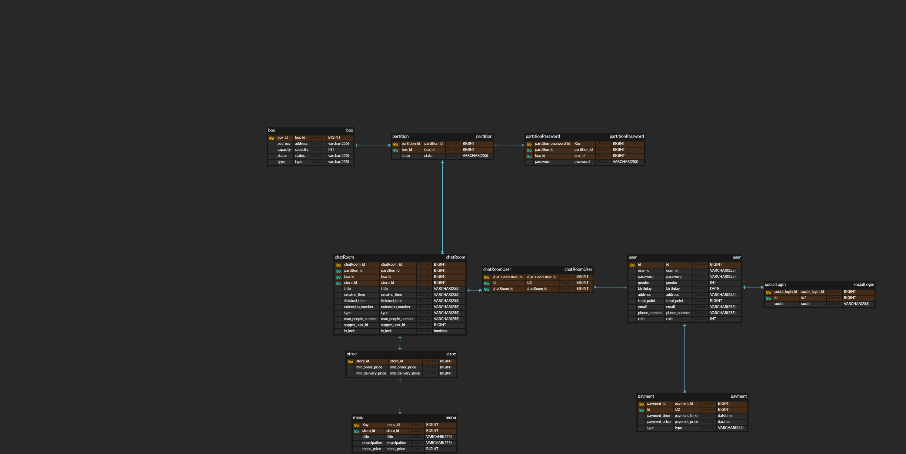

# 🚚 Keepham - IoT 기반 공유 배달함 서비스

   
  <h3>스마트한 공유 배달, Keepham과 함께</h3>

## 📋 목차
1. [프로젝트 소개](#프로젝트-소개)
2. [주요 기능](#주요-기능)
3. [기술 스택](#기술-스택)
4. [시스템 아키텍처](#시스템-아키텍처)
5. [주요 기술적 구현](#주요-기술적-구현)
6. [프로젝트 성과 및 인사이트](#프로젝트-성과-및-인사이트)

## 프로젝트 소개

Keepham은 공유 오피스를 위한 혁신적인 IoT 기반 공유 배달함 서비스입니다.
사용자 간 실시간 소통으로 공동 주문을 조율하고, 스마트 배달함을 통해 편리한 픽업 경험을 제공합니다.

- **진행 기간**: 2023.07.04 ~ 2023.08.18 (6주)
- **팀 구성**: 백엔드 개발자 4명, 프론트엔드 개발자 2명
- **담당 역할**: 백엔드 개발 및 인프라 구축

## 주요 기능

1. 🗨️ **실시간 채팅 기반 공동 주문**
   - WebSocket을 활용한 실시간 그룹 채팅
   - 주문 현황 실시간 공유

2. 📦 **IoT 스마트 배달함 시스템**
   - 실시간 배달함 상태 모니터링
   - QR코드/비밀번호를 통한 안전한 개폐 기능

3. 💳 **통합 결제 및 포인트 시스템**
   - 간편한 그룹 결제 처리
   - 유연한 포인트 적립 및 사용

## 기술 스택

### Backend

### Database & Caching

### Message Queue & Realtime Communication

### DevOps & Cloud

## 시스템 아키텍처

## 데이터베이스 설계 (ERD)

프로젝트의 데이터베이스 구조를 나타내는 Entity-Relationship Diagram(ERD)입니다:

주요 엔티티:
- box: 배달함 정보
- partition: 배달함 구획 정보
- chatRoom: 채팅방 정보
- store: 가게 정보
- menu: 메뉴 정보
- user: 사용자 정보
- payment: 결제 정보

---

## 주요 기술적 구현

### 1. 실시간 채팅 시스템
- WebSocket과 STOMP 프로토콜을 이용한 실시간 양방향 통신 구현
- Kafka를 메시징 큐로 활용하여 채팅 서버 간 메시지 동기화 및 부하 분산
- MongoDB의 Capped Collection을 활용한 효율적인 채팅 이력 관리

### 2. 보안 및 사용자 인증
- JWT 기반의 stateless 인증 시스템 구현
- Spring Security를 활용한 리소스 접근 제어
- Redis를 이용한 Refresh Token 관리로 보안 강화

### 3. IoT 배달함 연동
- MQTT 프로토콜을 이용한 IoT 디바이스와의 실시간 통신
- Kafka Streams를 활용한 디바이스 상태 실시간 처리 파이프라인 구축

### 4. 결제 시스템 연동
- Bootpay API 연동을 통한 안전한 결제 프로세스 구현
- 분산 락을 이용한 동시성 제어로 결제 데이터 정합성 보장

### 5. 예외 처리 및 로깅
- GlobalExceptionHandler를 통한 일관된 예외 처리
- LoggerFilter를 이용한 체계적인 API 로깅 시스템 구축

## 프로젝트 성과 및 인사이트

- 6주간의 집중 개발로 MVP 출시 및 베타 테스트 진행
- 실시간 처리가 필요한 대규모 시스템 설계 및 구현 경험 획득
- 분산 시스템 환경에서의 데이터 일관성과 장애 대응 능력 향상
- 다양한 기술 스택의 통합을 통한 복잡한 비즈니스 로직 구현 역량 강화

---

